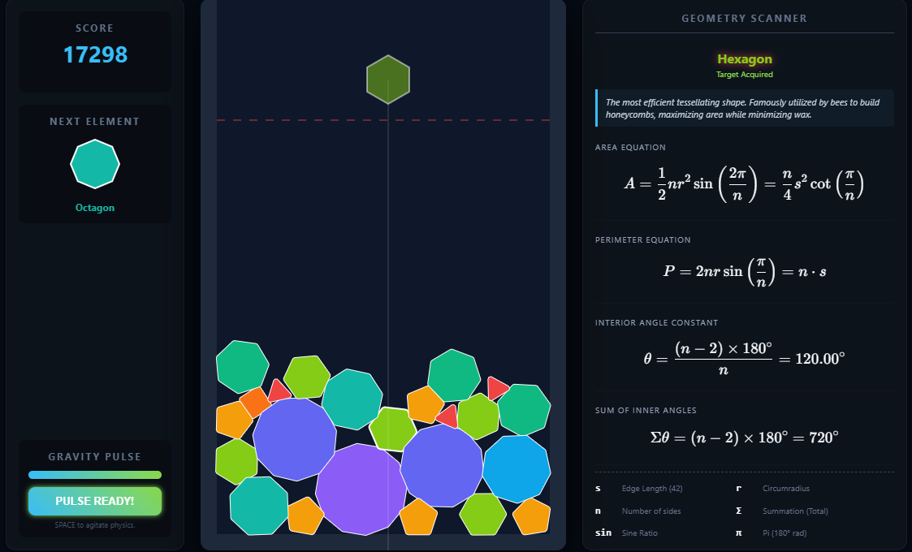

# Euclidean tessellation game

A game based on suika but for education.

The name is based on the pattern of euclidean tessellation when the player reach late into the game.

Built using:

- Matter.js for physic
- Ketex for latex math

